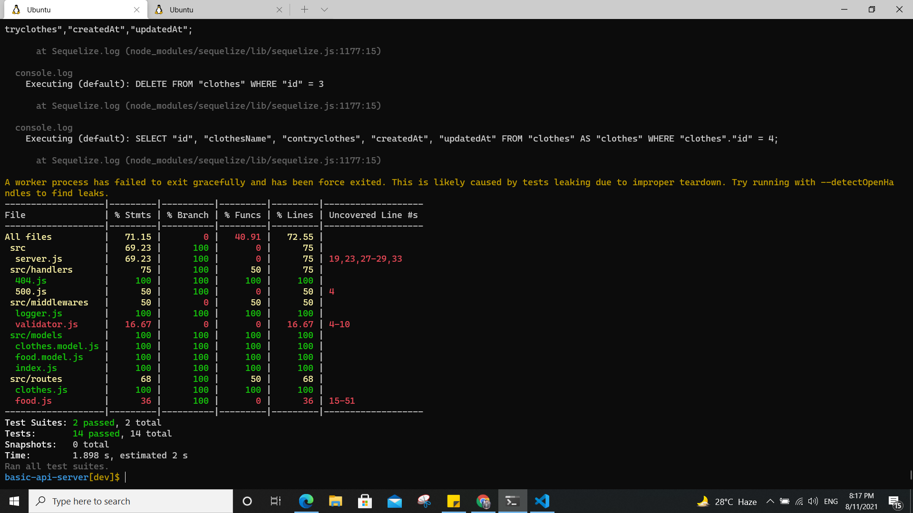
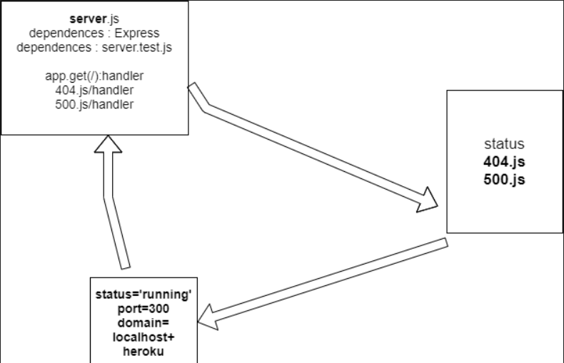

# basic-api-server
## .env sample/ PORT=8080

## npm run test
Test Suites: 2 passed, 2 total
Tests:       14 passed, 14 total

## Heruko link [main](https://basic-api--munther.herokuapp.com/)

/clothes
 {
    "id": 4,
    "clothesName": "blouse",
    "contryclothes": "france",
    "createdAt": "2021-08-11T16:29:28.370Z",
    "updatedAt": "2021-08-11T16:29:28.370Z"
  },

  /food
   {
    "id": 10,
    "foodName": "Knafa",
    "contryFood": "Jordan",
    "createdAt": "2021-08-11T16:06:53.527Z",
    "updatedAt": "2021-08-11T16:06:53.527Z"
  }

